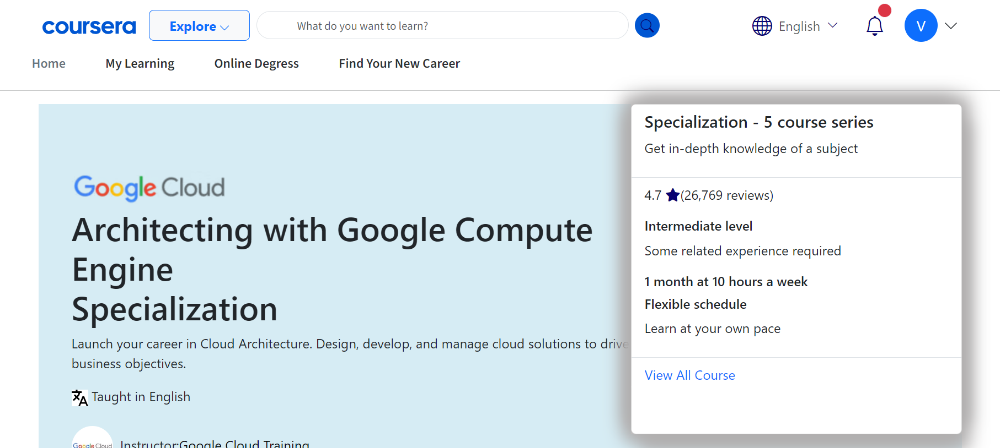

<h1 align="center">CourseEra Clone</h1>
This project is a clone of Coursera, a popular online learning platform. The clone replicates core features of Coursera, such as course browsing, enrollment, user authentication, and video streaming. This project aims to provide a comprehensive learning management system (LMS) for both students and instructors.

## Table of Contents
- [Demo](#demo)
- [Screenshots](#screenshots)
- [Features](#features)
- [Technologies Used](#technologies-used)
- [Contributors](#contributing)
- [Contact](#contact)

# demo 
Visit Our website: [CourseEra Clone](https://coursera-clone1.netlify.app/)

# screenshots

# Features
-My Learning page 
-Find Your New Career:

# "Find Your New Career" is a feature designed to help students transition from learning to professional opportunities. Here are the detailed features:
  1. Career Guidance
  2. Resume Builder
  3. Job Search
  4. Application Management
  5. Interview Preparation
  6. Networking
  7. Internships and Projects
  8. Mentorship
  9. Workshops and Webinars
  10. Portfolio Development

# Tech Stack

  1. Bootstrap V5.1.3
